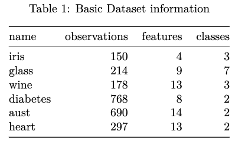
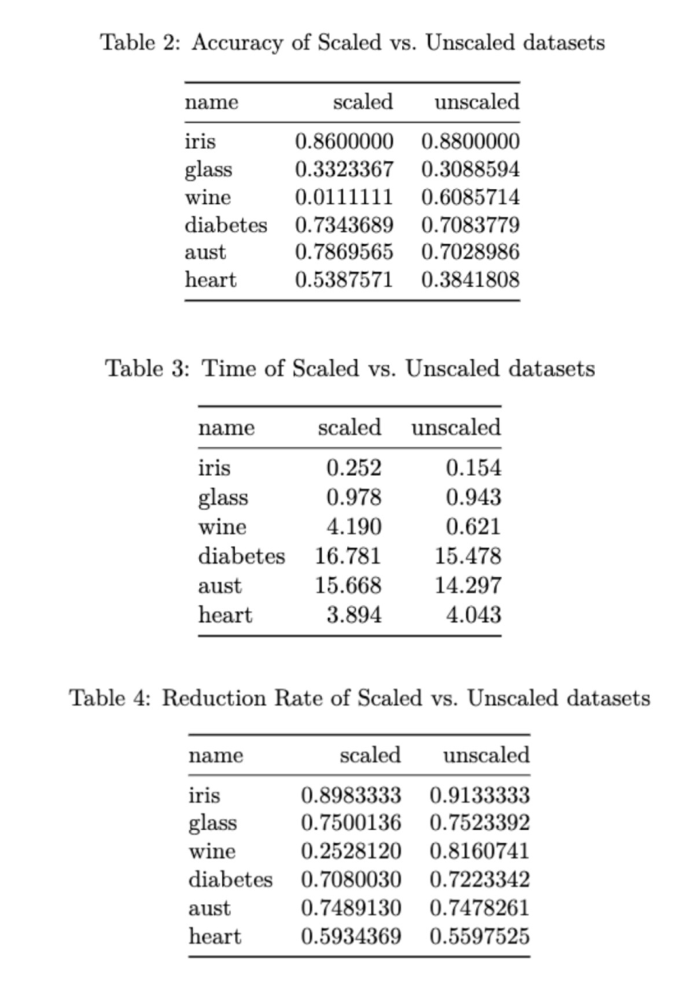
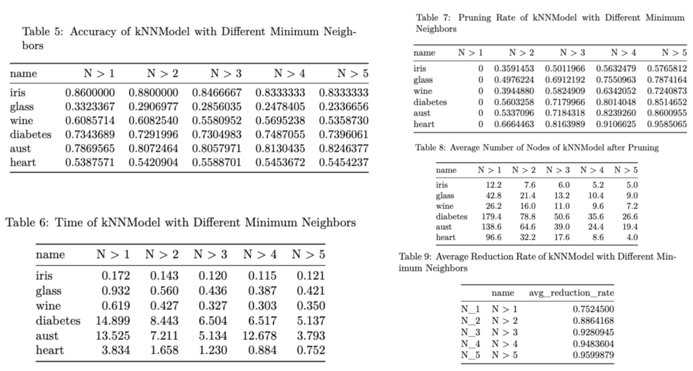
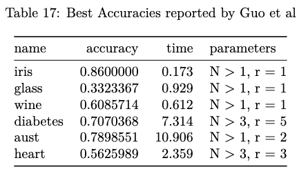
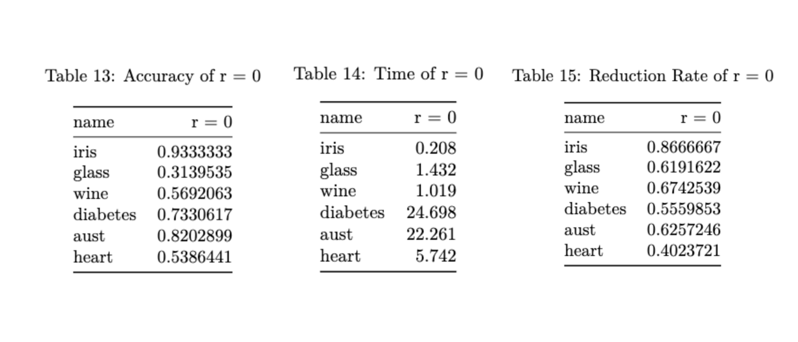
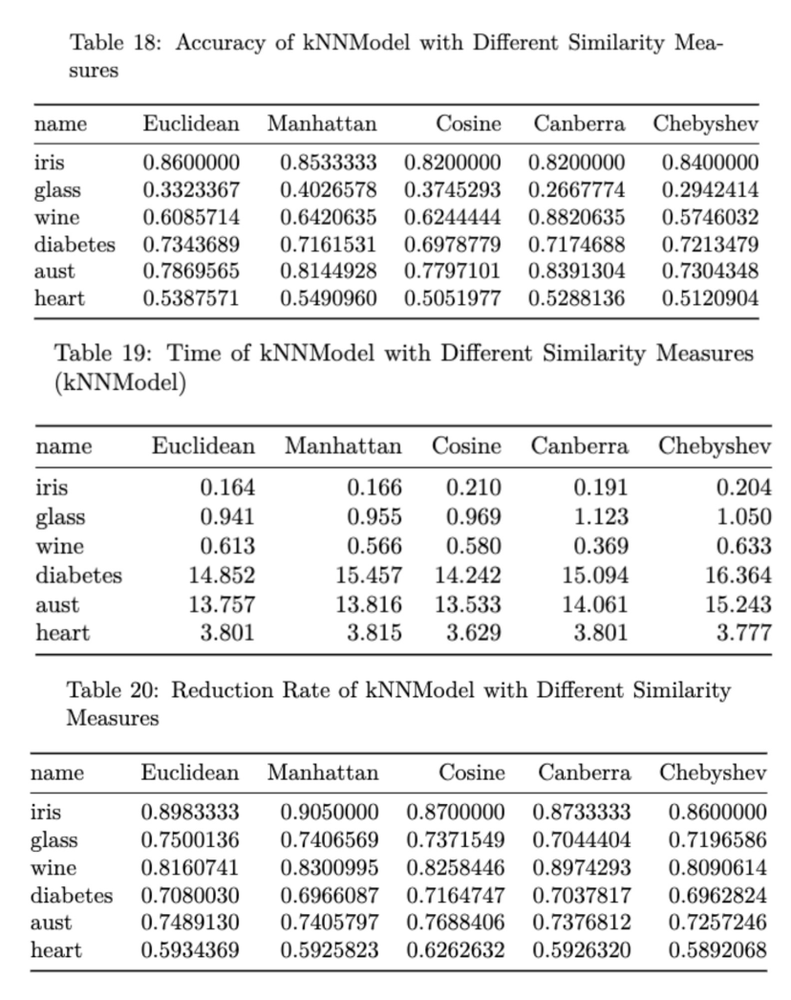
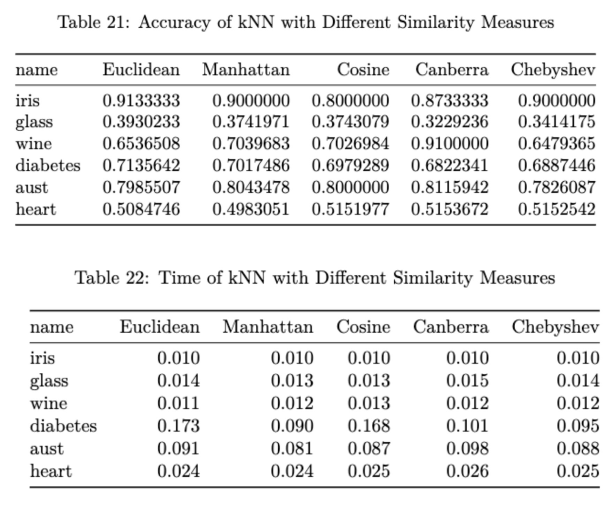
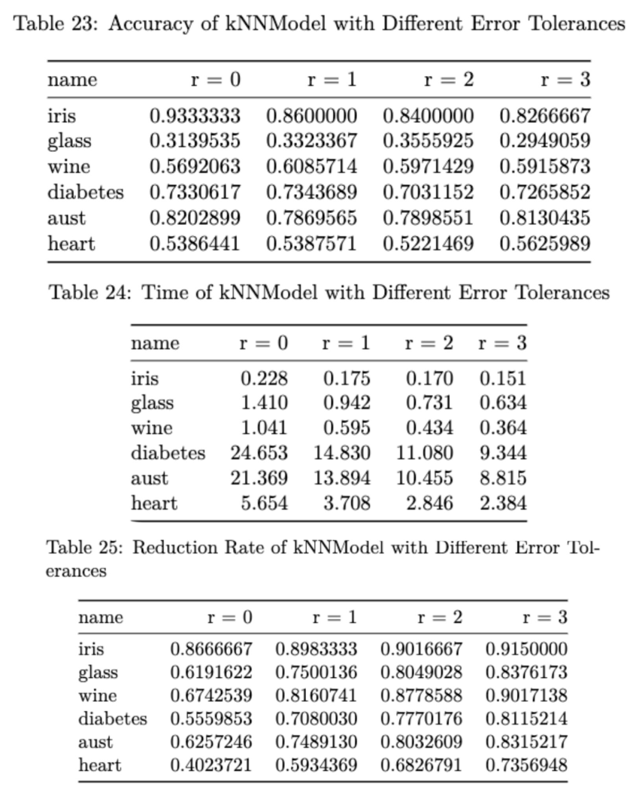

```{r setup, include=FALSE}
knitr::opts_chunk$set(echo = TRUE)
library(knitr)
library(tidyr)
library(dplyr)
library(proxy)
library(ggplot2)

# Why would someone prefer knn over other classification models (non parametric for no assumptions), a lot of predictors wouldnt be good for knn becuase of curse of dimensionality
# similarity measures include euclidean, manhattan, and cosine, but any other suggestions and why, u can cite a website that explains all the definitions

# should i describe kNNModel's algorithm earlier since the introduction mentions represntatives and where should i describe it, can it be one sentence.
```

# 1) Introduction

K-Nearest Neighbors, or kNN, is a widely used non-parametric algorithm for both regression and classification problems. It is a supervised learning algorithm, relying on training data and its given labels to predict new data points. When the amount of observations approach infinity, the kNN classifier approximates the Bayes classifier, which produces the lowest possible test error rate (Hastie et al., 2009, pp. 21-22; S.Zhang, 2022). This makes kNN an ideal algorithm, for both regression and classification, as well as since it is non-parametric, no assumptions are made on the distribution of the observations. kNN can be applied to multiple different contexts, including text classification, image classification, financial market predictions, and more.

However, kNN has many drawbacks, such as slow computation times, curse of dimensionality for a large number of predictors, and being required to pick a k. Because the algorithm calculates the distances between the new point and each training point, this computation time increases when the number of training observations increases. When more predictors are introduced, the points are placed in higher dimensional spaces, which causes similarity measures such as Euclidean to lose more meaning, leading to poorer accuracy. Additionally, the presence of noisy data can heavily impact the accuracy, causing an increase the error rate in classification (Liu & Zhang, 2012). Noisy data typically arises from various means, including entry errors and missing information, which can negatively impacts the accuracy. When picking the k values for kNN, lower k values are associated with overfitting of the model, while higher k values cause underfitting. The optimal k lies in between, though it would have to be manually tested and picked (S. Zhang, 2022).

Guo et al. introduces a new kNN algorithm, kNNModel, which finds a group of representatives instead to represent the entire dataset and then performs the typical kNN with the similarity measure of choice (Guo et al., 2003). Since similar points in the training set are close to each other in the metric space, kNNModel groups them, it creates a neighborhood around the centermost point of each group. The default kNN algorithm is then performed on these representatives, rather than the entire dataset, with extra rules on classification. If the new test point is within exactly one representative's neighborhood, it is classified as the representative's class. If the new test point is within two or more representatives' neighborhoods, it is classified as the class of the representative who's neighborhood contains the most points. If the new test point is within none of the neighborhoods, it is classified as the class of the representative who's neighborhood boundary it is closest to. This algorithm significantly reduced the computation time as well as picked the optimal k which gave the best accuracy, in comparison to the kNN algorithm.

In this paper, based off of previous research done by Guo et al., we expand on their proposed kNNModel algorithm. The original paper studied the impact of different choices of minimum representatives and error tolerances, which led to faster computation times and the ability to find the optimal k. We will explore more applications, such as different similarity measures and error tolerance, to improve the accuracy and computation times.

The rest of the paper is organised into the following sections. Section 2) Main Proposal discusses the additional tests considered to expand on kNNModel's potential. Section 3) Related Work explores similar papers which attempted to solve the problems presented in this paper. Section 4) Prior Knowledge defines some technical terms and metrics used throughout the paper. Section 5) kNNModel Algorithm describes the algorithm and methods from the original paper and defines other relevant terms. Section 6) Experiment and Evaluation is split into two subsections, Section 6.1) Replication and Section 6.2) Additional Testing, with more information about the experiments in those sections. Section 7) Conclusion discusses the final results, limitations, and other possible future works. Section 8) Acknowledgements contains additional thanks. Section 9) Bibliography includes all the sources cited in this paper. Section 10) Appendix is the final section, which lists all the code used in Section 6) Experiment and Evaluation section.

# 2) Main Proposal

In addition to replicating the original paper's tests, we will explore more different alterations to kNNModel, as well as provide more information. In the original paper, Guo et al. mainly focused on analyzing the impact of minimum number of representatives and error tolerance to computation times and accuracy. The paper used Euclidean as the similarity measure through each test. We will explore other similarity measures, such as Manhattan, Mahalanobis, Cosine distance,  to examine their effects on accuracy and computation times. Additionally, we provided tables on runtime of each dataset for each test, and although this is heavily dependent on our implementation, it can help provide a comparison between datasets and kNN. Some basic information about each similarity measure is presented below.

- Euclidean is the most commonly used distance function, since it represents the shortest distance between two points (Harmouch, 2025). However, Euclidean distance can be less informative in higher dimensions.

- Manhattan is preferred, since many datasets can contain large number of predictors, which makes Euclidean perform worse in higher dimensions. Manhattan is also less sensitive to outliers and is computationally faster.

- Mahalanobis distance is useful when predictors are correlated. It computes the distance using the covariance matrix and factors in covariance between the predictors. However, it does not work well in high-dimensional data, so it may be explored in future works.

- Cosine similarity computes the similarity between two points in terms of direction and not magnitude. It works well in high-dimensional data and is computationally faster.

- Canberra distance is the weighted version of Manhattan distance, and typically used in clustering. It is not heavily affected by outliers.

We will also be performing an additional test on the effect of increasing the error tolerance on accuracy and runtime.

# 3) Related Works

Computation time is one of the major drawbacks of kNN. Since the distance from the test point to each point in the training set is calculated for every test point, the computation cost starts to increase significantly when the number of training and testing observations increases. Several papers attempted to resolve this issue, such as using data reduction methods or different data structures. Data Reduction Techniques (DTR) are different methods of reducing the training dataset in order to conserve memory, while also preserving the accuracy (Filippakis et al., 2023). Some examples include prototype selection and prototype generation. Prototype selection selects specific points from the original dataset, while prototype generation builds on the idea that data points similar to each other belong to the same class. kNNModel, which was based on the same principle as prototype generation, was proposed by Guo et al. as a way to reduce computation times by reducing the amount of training points used to a select number of representatives (Guo et al., 2003). These representatives were selected through a grouping algorithm, then kNN was performed on these representatives, rather than the entire training dataset, with some additional conditions. The computation times significantly decreased, as well as choosing the optimal k that leads to the greatest accuracy. Another paper makes use of space-filling curves (Peano-Hilbert curves), which reduces the dimensions, and constructs multiple Peano curves, resulting in computations being completed 5-7 times faster than the default kNN (Barkalov et al., 2022).

Experimenting with different data structures also helped to reduce the computation times. TFKNN (Tree-Fast-K-Nearest-Neighbor), a method involving implementing an SSR tree, a data structure based off of similarity between different data points (Wang & Wang, 2007). The training points are sorted and stored in this tree, reducing the searching to a specific tree only, which significantly reduced the computation time. Condensed Nearest Neighbour (CNN), proposed by Peter Hart, builds off the idea that patterns in the training set can be similar, with some adding no extra information so they will be discarded (Hart, 1968). Removing similar patterns can reduce computation time, as it is repetitive. Yianilos presents a vp-tree (vantage point tree), with a construction time of $O(nlog(n))$ and search of $O(log(n))$, similar to the standard sort and binary serach in one dimension (Yianilos, 1993). Searching for the k nearest neighbors can then be shortened through the use of various data structures.

# 4) Prior Knowledge

Some prior knowledge of the terms mentioned in the paper will be required. Reduction Rate, Pruning Rate, Average Reduction Rate, and Error Tolerance are described below. Pruning Rate and Average Reduction Rate are primarily used for the Minimum Neighbors Test, which is discussed further in Section 6).

## 4.1) Reduction Rate

Because kNN suffers from long computation times due to the amount of points in the training set, data reduction techniques are employed as a solution. These techniques involve taking a subset of the training points that can shorten the computation times, as well as still maintain equal or higher accuracy than the original dataset. The reduction rate represents the ratio of how much the original training dataset was reduced by (Filippakis & Ougiaroglou, 2024).

$$
\text{Reduction Rate} = 1 - \frac{\text{Representatives}}{\text{Total Training Points}}
$$

In this paper, two data reduction techniques are introduced, pruning and error tolernace. Pruning involves removing any representatives whose neighborhood contains neighbors less than a specific threshold, while error tolerance allows a certain amount of points to stay within a neighborhood, whose class differs from the majority. In the above equation, the reduction rate is obtained by subtracting the ratio of number of representatives to the total number of training points before pruning from 1. For example, a reduction rate of 0.8 means that after performing the data reduction technique, the training data was reduced to just 20% of its original size.

## 4.2) Pruning Rate

Pruning rate refers to the ratio of how many representatives remaining after pruning. For a specified threshold, say k, any representative whose neighborhood has less than k neighbors is removed from the representative list. 

$$
\text{Pruning Rate} = 1 - \frac{\text{Pruned}}{\text{Total Representatives}}
$$
While this metric was only introduced once in one of the tests, it is helpful in analyzing the relationship between accuracy and number of representatives by removing potentially noisy data ponts. For example, a pruning rate of 0.6 indicates that out of the chosen representatives from model training, the final list of representatives is down to 40% of its original size.

## 4.3) Average Reduction Rate 

Average Reduction Rate is the average reduction rate over the chosen datasets for N > j, where j is a fixed value ^[This formula was derived from the original paper and is used in the relevant experiments, however, Guo et al. did not formally list their formula.]. If we would like to find the average reduction rate for N > j, then we will first find the average representative corresponding to each N > j for each dataset individually, call this Individual Average Rate (IAR) then find the average of those averages. The IAR requires cross validation.

$$
\text{Individual Average Representatives}_j =\frac{\sum_{i = 1}^{n}\text{R}_i}{\text{K}}
$$
Where K refers to the number of folds used for cross-validation and $R_i$ refers to the number of representatives on the i-th fold. 
$$
\text{Average Reduction Rate}_j = 1 - \frac{\sum_{i = 1}^{n}\text{IAR}_i}{\text{Total Number of Datasets}}
$$
Where $\text{IAR}_i$ is the individual average representative for the i-th dataset.For example, if we have an average reduction rate of 0.85 for N > 2, then on average, the training data is reduced to 15% of its original size where each representative has at least 3 neighbors. Then, this gives us the Average Reduction Rate for N > j. 


## 4.4) Error Tolerance

Error Tolerance, denoted as r, refers to the amount of neighbors in a neighborhood that have classes differing from the majority class of this neighborhood. For example, if r = 2, then for a neighborhood whose points are all from class A, at most 2 points with a class other than A can belong in this neighborhood. This helps prevent noise in the dataset from misclassifying points. By allowing this error tolerance, this potentially removes any neighborhoods formed from few amounts of neighbors.

# 5) kNNModel Algorithm

This section and its following subsections summarizes the kNNModel algorithm proposed by Guo et al. (2003). There are two parts to the algorithm, the model training and evaluation. Model training involves the grouping algorithm for selecting the representatives from the training dataset. Evaluation explains the algorithm of classifying new test points using the representatives and additional conditions.

Additionally, two pruning methods were proposed to improve the accuracy. Each experiment will specify which of the pruning methods is used.

## 5.1) kNNModel Training

The model training stage involves finding a subset of the dataset to represent the entire dataset based on the original paper's proposed algorithm. kNNModel is trained as follows:

1. Create a similarity matrix of the training data corresponding to the similarity of choice (euclidean, manhattan, etc.).

2. Initialize all points in the training data to ungrouped and create an empty list for the representatives.

3. Loop through each ungrouped point in the training dataset and do the following:

    3.1. Create a neighborhood around each point, consisting of as many points sharing the same class as possible.
  
    3.2. Find the global largest neighborhood, the neighborhood with the most points. If two or more neighborhoods share the same amount of points, pick the neighborhood with the smallest radius.
  
    3.3. Group all observations in the global largest neighborhood, and save the centermost point (the point that the neighborhood was created around) as the representative to the list of representatives. Each representative has their index, radius, size, and class associated with them.
  
4. Return the list of final representatives.

## 5.2) kNNModel Evaluation

After training, kNNModel is evaluated using the list of representatives from earlier, the similarity measure, training data, and testing data. It is evaluated as follows:

1. Loop through each point, $x_i$, in the testing data and do the following:

    1.1. Compute the similarity matrix of the testing point to each point in the representatives list.
  
    1.2. Create an empty list representing the neighborhoods, $\text{neighborhood}_{x_i}$, that $x_i$ falls in. Loop through each representative and do the following: 
  
      1.2.1 Compare the distance between the representative and $x_i$. If the distance is less than the representative's radius, then $x_i$ falls in this neighborhood and add this neighborhood to the above list.
  
    1.3. Classify the point according to one of the following cases:
    
      1.3.1. Case 1: If $\text{neighborhood}_{x_i}$ only contains one neighborhood, assign $x_i$'s class to this neighborhood's.
      
      1.3.2. Case 2: If $\text{neighborhood}_{x_i}$ contains multiple neighborhoods, assign $x_i$'s class to the neighborhood with the largest size. If multiple neighborhoods have the same size, pick the neighborhood who has the smallest radius.
      
      1.3.3. Case 3: If $\text{neighborhood}_{x_i}$ contains no neighborhoods, assign $x_i$'s class to the neighborhood whose boundary it is closest to. This distance is the same as the difference of the distance from $x_i$ to the representative and the representative's radius.
      
    1.4. Once a point is classified, compare it to the true class from the test dataset. If it is correct, then add one to the accuracy value, the number of test obesrvations correctly predicted.
    
2. Return the final accuracy, which is the accuracy value divided by the number of observations.

## 5.3) Pruning Methods

During the training stage where representatives are selected, two methods are proposed to help filter the representatives or add flexibility to their neighborhoods. These methods were introduced with the purpose of dealing with noisy data.

### 5.31) Method 1: Minimum Nodes

1. Specify a number, j, which serves as the minimum amount (exclusive) of neighbors a neighborhood must have.

2. Create an empty list and loop through the list of representatives.

    2.1. For each representative, compare its neighborhood size to the specified j. If the neighborhood is greater than j, add it to the new list.
    
    2.2. Return the new list of representatives.

This method was introduced to potentially remove any representatives who were deemed as noisy data points. If j = 0 is specified, the method is effectively not in use, so the method simply returns the original list.

### 5.32) Method 2: Error Tolerance

1. Specify a number, r, which serves as the maximum amount of misclassified neighbors among a neighborhood.

2. During the model training stage, for each representative, continue adding points whose class matches the representative.

    2.1. If a point whose class differs from the representative is encountered, add 1 to the mismatch count.

    2.2. If the mismatch count is less than or equal to r, add the data point to the neighborhood. Otherwise, finalize the neighborhood.
    
This method is an alternative to Method 1. If r = 0 is specified, the method is effectively not in use, so every neighbor in each neighborhood share the same class as the majority.

While both deal with attempting to improve accuracy on noisy data, Method 1 focuses on removing representatives who cover too little area, and Method 2 allows some misclassified points to reside within a neighborhood whose majority class differs from them.

# 6) Experiment and Evaluation

This section will be separated into two parts, Replication and Additional Testing. Replication focuses on following the original research paper by Guo et al. (2003), while Additional Testing explores kNNModel's limitations through varying the similarity measures and error tolerance values.

## 6.1) Replication

To follow Guo et al., we will replicate their process first. We start with feature engineering and data pre-processing, then we will conduct multiple experiments evaluating the accuracy using Euclidean distance similarity. Most of these tests will be evaluated against the benchmark, kNN, which was trained on k = 1, 3, and 5, and uses Euclidean distance, which follows the original benchmark. Due to resource limitation, C5.0, the second benchmark model used in the original paper, will not be used.

The experiments covered will be Minimum Neighbors, r = 0, Best Accuracy, and Influence of r on Aust and Glass. They will be expanded in more detail in the following subsections.

### 6.11) Feature Engineering

A table with some basic information is presented (Appendix 5.1). 

```{r, echo=FALSE, out.width="65%", fig.align='center', fig.cap = "Basic Information of the 6 Datasets"}

```


Data pre-processing was done prior to further evaluation on the kNNModel algorithm, such as normalization and one hot encoding (Appendix 5.2). To start, the scaling function in R was used to normalize the data, and accuracies were evaluated based on scaled vs. unscaled data (Appendix 5.3). Normalization is done to ensure all values are on the same scale, as this can impact the distance calculations between the points. Two of the datasets, Aust, and Heart, contains non numerical data, so one hot encoding was performed on them to convert them to numerical values. The error tolerance, r, is set to 1, and min node was set to 0, to remain consistent.

```{r, echo=FALSE,out.width= "55%", fig.align='center', fig.cap = "Statistics of Scaled vs. Unscaled", fig.pos = 'H'}

```

From the table, Iris, Glass, and Diabetes' accuracies are similar and differ by a minimal amount.  Wine's scaled accuracy has a noticeably significant drop, from 60.8% unscaled, to 1% scaled, which suggests that Wine's dataset is not similar to the normal distribution and is possibly heavily skewed. Aust and Heart's accuracy increased a noticeable amount with scaling. Based on the accuracies, Iris, Glass, Diabetes, Aust, and Heart datasets will proceed with the scaled version, whereas Wine will proceed with the unscaled version.

### kNN Benchmark

As a benchmark, kNN is implemented with k = 1, 3, and 5 to remain consistent with the original work (Appendix 5.4). The following statistics are presented below and will be referred to by their table numbers.

```{r, echo=FALSE, out.width="100%", fig.align='center', fig.cap = "kNN Statistics for various k", fig.pos = 'H'}
knitr::include_graphics("images/figure3_kNN.png")
```


### 6.12) Minimum Neighbors

Guo et al. proposes two methods of pruning, removing representatives whose neighborhood is less than a specified amount, and introducing an error tolerance, where a specified amount of neighbors, whose class is different than the majority, can still remain in this neighborhood. This section focuses on Method 1, whereas Section 6.14) and 6.3) analyzes Method 1's effects through varying r.

First, we will replicate the first experiment, which involved pruning the neighborhoods to have greater than i neighbors for i = 1, 2, 3, 4, 5 (Appendix 5.5). We will set r = 1 as the error tolerance for each test. Euclidean distance is used for each test.


```{r, echo=FALSE, out.width="95%", fig.align='center', fig.cap = "Effect of varying Minimum Nodes (j) with Accuracy", fig.pos = 'H'}

```

While the baseline accuracy for each dataset is lower than Guo et al., due to differences in data pre-processing, the trends in accuracy as the minimum node, j, increases are similar. For example, the Iris, Heart, and Diabetes datasets all follow consistent accuracy as j increases, which is on track with Guo et al.'s. Glass and Wine both follow a slowly decreasing rate in accuracy as j increases, however, only glass in the original experiment follows this trend. Interestingly, Aust's accuracy slowly increases when j increases, and the original experiment showed that it remained consistent with j increasing; the rate at which it decreases is slower. Overall, most of the trends were on par with Guo et al.'s.

In comparison with kNN (Figure 3), the best accuracy for each dataset is about 2-6% less than kNN's best, except for Diabetes. kNN's runtime is about 10 times faster than kNNModel on Iris, Glass, and Wine, and can be up to 100 times faster on the Diabetes, Aust, and Heart datasets. However, the average reduction rate (Figure 4, table 9) shows that anywhere from 75% to 95% of the dataset is removed using kNNModel's algorithm. With almost a quarter of the dataset being reduced to a few representatives, kNNModel's accuracy only falls short behind kNN while using less training points.

### 6.13) Best Accuracy

In the following table, Guo et al. presents the best accuracy for a given r and minimum nodes, j, compared to kNN calculated on k = 1, 3, and 5. Due to resource limitations, we decided to replicate these results by selecting the r and j given by Guo et al., and compared them to kNN (Appendix 5.6).

```{r, echo=FALSE, out.width="85%", fig.align='center', fig.cap = "Best Accuracies for each dataset with a specific minimum node and r", fig.pos = 'H'}

```

From the table, Iris, Glass, and Wine all have accuracies similar to the best ones reported throughout this paper. Diabetes has a slightly lower accuracy, as we can see that its accuracy hovers around 73% (Figure 4, table 5), so it may perform better with lower r. Aust's accuracy can be slightly improved, although it does not differ much from the best accuracy found in Figure 4, table 5. Heart appears to perform well compared to the other tests involving it. In comparison with kNN, while our data wasn't able to support Guo et al.'s claim of kNNModel picking the optimal k, we found instead that the accuracies were within 4% of the average classification accuracy of kNN instead (Figure 3, Table 16). With the exception of Aust, we observe that the datasets perform well on lower values of N and r, supporting Guo et al.'s conclusion.

### 6.14) Influence of r on Aust and Glass

Next, we analyze the effect of varying r from 0 to 10 on accuracy. Due to computational limits, we varied r from 0 to 10, rather than 0 to 15, but we still seek to find a similar trend (Appendix 5.7). The minimum node, j, is set to 1.

```{r, echo=FALSE, out.width="85%", fig.align='center', fig.cap = "Effect of varying Error tolerance (r) on Accuracy", fig.pos = 'H'}
knitr::include_graphics("images/graph1_aust_glass_error_tolerance.png")
```

From the graph, accuracy peaks on both datasets when r is a lower value. The Glass dataset follows a similar shape to Guo et al., where the initial peak occurs around r = 1, before it decreases with occasional peaks. However, Aust has a flatter shape compared to Guo et al.'s, possibly due to the data pre-processing differences, as Aust frequently doesn't follow the same trends as the original experiment. Both tests show that the accuracy tends to peak at lower values of r before having a downwards decreasing trend.

### 6.15) Error Tolerance (r = 0)

We test the effect of r = 0 on the accuracy without selecting a minimum node. In this case, we set j = 0 to indicate that all neighborhoods contain at least 1 neighbor, possibly the representative itself (Appendix 5.8).

```{r, echo=FALSE, out.width="85%", fig.align='center', fig.cap = "Effect of r = 0 on Accuracy", fig.pos = 'H'}

```

Iris, Diabetes, and Aust all have accuracies close to the original paper, around 2% within range. However, their reduction rates fell behind Guo et al.'s, anywhere from 10-30% below. This means that despite having similar accuracies, our implementation still requires more training points in order to match their accuracy. For the other datasets, Glass, Heart, and Wine, their accuracies are lower than Guo et al.'s by around 20-40%. Their reduction rates are on the lower end, anywhere from 40% to high 60%, while Guo et al.'s reduction rates remained around the 80% to high 90% across all 6 datasets. The inconsistencies in our reduction rates across different datasets are attributed to data pre-processing. Further investigation into the effect of error tolerances is in Section 6.22).

## 6.2) Additional Testing

In this section, we explore more of kNNModel's potential through two main tests, Similarity Testing and Error Tolerance. Similarity Testing involves analyzing with kNNModel's accuracy across five different similarity measures, while Error Tolerance is an extended test of Section 6.15), where we vary r and analyze its effects on accuracy.

### 6.21) Similarity Testing

We will be exploring other similarity measures, including Manhattan, Cosine similarity, Chebyshev, and Canberra. We set r = 1 as the error tolerance for these tests. kNN with k = 1 will be used as the benchmark to compare kNNModel's performance (Appendix 5.9).

```{r, echo=FALSE, out.width="65%", fig.align='center', fig.cap = "Similarity Testing of kNNModel", fig.pos = 'H'}

```

```{r, echo=FALSE, out.width="65%", fig.align='center', fig.cap = "Similarity Testing of kNN", fig.pos = 'H'}

```

From table 18, we see that depending on the dataset, the five similarity measures either caused the accuracy to fluctuate or remain consistent. For example, Iris, Diabetes, and Heart had minimal differences in accuracy between the similarity measures. Glass had the highest accuracy on Manhattan, while having lower accuracies on Canberra and Chebyshev. Aust had slightly consistent accuracy, having around 80% accuracy on Manhattan and Canberra, while having high accuracy in the 70s for Euclidean, Cosine, and Chebyshev. Interestingly enough, Wine appeared to have roughly consistent accuracy around the 60s, except for Canberra, in which it peaked at 88.2%, making it the highest accuracy in the table. Wine, a dataset which was possibly skewed, benefitted the most from Canberra, which could be explored more in future works.

Overall, across all datasets, Euclidean appears to be the most stable and consistent, its accuracy being the best or in the middle of the five. Manhattan regularly outperforms Euclidean, while maintaining similar computational times. Cosine, Canberra, and Chebyshev have mixed performances depending on the dataset. Cosine performs in the middle or at the bottom, as well as Canberra, with the exception of Wine. Chebyshev has one of the lowest accuracy of the five on average.

In terms of reduction rate, each similarity measure's reduction rate hovers around the average with minimal differences. Cosine has the middle to highest reduction rate of the five, while Chebyshev generally has the lowest reduction rate.

Comparing to kNN, the accuracies of kNNModel are typically, at most, 6% less than kNN. The computational time also seems to be a smaller fraction of kNNModel's. However, kNNModel achieved its accuracy using anywhere from 50% to 10% of its training dataset.

### 6.22) Error Tolerance (r = 0, 1, 2, 3)

We will also be further exploring the effects of increasing r across all datasets. kNN evaluated at k = 1, 3, and 5 will be used as comparison (Appendix 5.10).

```{r, echo=FALSE, out.width="65%", fig.align='center', fig.cap = "Effect of Error Tolerance on Accuracy", fig.pos = 'H'}

```

From the table, we observed that Iris, Diabetes, and Aust perform well on lower r values. Glass slowly increases in accuracy when r increases, up until r = 2, and decreases, as shown in Section 6.14) Heart has an inverse relationship from the others, their accuracy slowly increasing when r increases, which implies that Heart may have noisy data points causing misclassification. Wine is also similar, their accuracy remaining around 59% when r is at least 1.

Comparing to kNN, Iris shares the same accuracy trend on both models when r and k increase. Glass increases in accuracy when r increases on kNNModel, while it decreases when k increases in kNN. Wine and Heart both have stable relationships on kNNModel, while Wine decreases and Heart increases on kNN. Diabetes and Aust have inconsistent relationships on kNNModel when r increases, while they are shown to be increasing when k increases on kNN. The relationship between increasing r and k with their model's respective accuracy seems to have no correlation, with the exception of Iris, as Iris' distribution is simpler and contains less noise compared to the others.

# 7) Conclusion

In this paper, we replicated the kNNModel algorithm, proposed by Guo et al., on six different datsets from the UCI Machine Learning Repository, and analyzed its effect on accuracy and computational times through experimenting with the parameters. We found that the kNNModel algorithm produces similar accuracies to kNN with fewer training data points due to the grouping algorithm Guo et al. presented. kNNModel begins by finding a subset of the training data to represent a group of points, based on the idea that points of similar classes are closer together. Neighborhoods are formed around these representatives, so every point in the neighborhood, aside from the representative, share the same classification as the representative. Two pruning methods are introduced to prevent overfitting and noisy data. Method 1 involves removing representatives from the final list whose neighborhood size is less than a specified amount. Method 2 involves allowing a certain number of neighbors, whose class differs from the majority of the neighborhood, to reside within this neighborhood. Both methods aim at reducing noisy data and preventing the model from overfitting. During the evaluation stage, the algorithm is similar to the standard kNN, where the distance from the observation to each representative is calculated. Additional rules are added based on how many neighborhoods the observation falls in. With the amount of distance calculations between the observation and each training point being reduced to only the observation and a select amount of representatives, the computation time would be reduced. The additional rules during evaluation would allow kNNModel to select the optimal k value for classification.

While this paper was unable to replicate the fast computational times and the optimal k, we were, however, able to replicate similar accuracies to kNN with fewer training points. For example, Section 6.2) Similarity Testing was able to obtain similar accuracies to kNN on 50% to 10% of the original dataset. kNNModel's data reduction through grouping points under a representative proves effective in maintaining similar accuracies to kNN. Additionally, higher accuracies were observed on smaller values of r, error tolerance, and j, minimum nodes, which were on par with Guo et al.'s conclusions. Section 6.14) was able to highlight a similar trend in accuracy of Glass to the original paper.

However, the computational times were still longer than kNN, this was due to our implementation of the algorithm, as we used many for loops in both the training and evaluation stages, which resulted in $O(n)$ runtime for each loop, and $O(n^p)$ runtime for p nested loops. The longer computational times came from our implementation searching for the representatives, and if we can optimize this workflow in a future work, we believe that runtime can be similar or even faster than kNN, since the data has been reduced to fewer training points while keeping consistent accuracy. Additionally, our accuracies for kNNModel were, on average, lower than Guo et al., due to differences in data pre-processing, so we focused on making comparisons with kNN or observing similar trends. Some trends remained consistent with the original paper, for example, Iris, Heart, and Diabetes' accuracy trends typically followed the original paper's. However, some datasets, especially Aust, resulted in either inverse or uncorrelated relationship to Guo et al.'s. More improvements in data pre-processing and feature engineering can potentially fix the incorrect relationships presented, as well as assist with lowering the longer computational times.

Some future works include more experimentation with similarity measures. Euclidean is the standard option for kNN and other related models, however, its accuracy begins to diminish in higher dimensions when more predictors are introduced. We would like to explore more, such as Mahalanobis, which we were not able to implement due to its long computational times, or expand further on others, such as Canberra, which unexpectedly performed well on the Wine dataset. Experimentation with r, error tolerance, and j, minimum nodes, with similarity measures other than Euclidean can be beneficial in seeing how r and j can be influenced by different similarity measures.

# 8) Acknowledgements

I would like to thank Professor Guo Yu for encouraging me to learn more about kNN through a simulated PHD research style work and my roommate, Sadiyah, for proofreading my paper and giving helpful suggestions.

# 9) Bibliography

Aeberhard, S. & Forina, M. (1992). Wine [Dataset]. UCI Machine Learning Repository. https://doi.org/10.24432/C5PC7J.

Barkalov, K., Shtanyuk, A., & Sysoyev, A. (2022). A Fast kNN Algorithm Using Multiple Space-Filling Curves. Entropy, 24(6), 767. https://doi.org/10.3390/e24060767

Filippakis, P., Ougiaroglou, S., & Evangelidis, G. (2023). Prototype Selection for Multilabel Instance-Based Learning. Information, 14(10), 572. https://doi.org/10.3390/info14100572

Filippakis, P., & Ougiaroglou, S. (2024). Condensing multi-label data based on Clustering. Proceedings of the 28th Pan-Hellenic Conference on Progress in Computing and Informatics, 244–249. https://doi.org/10.1145/3716554.3716591

Fisher, R. (1936). Iris [Dataset]. UCI Machine Learning Repository. https://doi.org/10.24432/C56C76.

German, B. (1987). Glass Identification [Dataset]. UCI Machine Learning Repository. https://doi.org/10.24432/C5WW2P.

Guo, G., Wang, H., Bell, D., Bi, Y., & Greer, K. (2003, November). KNN model-based approach in classification. In OTM Confederated International Conferences" On the Move to Meaningful Internet Systems" (pp. 986-996). Berlin, Heidelberg: Springer Berlin Heidelberg.

Harmouch, M. (2025, January 28). 17 types of similarity and dissimilarity measures used in data science. Towards Data Science. https://towardsdatascience.com/17-types-of-similarity-and-dissimilarity-measures-used-in-data-science-3eb914d2681/ 

Hastie, T., Tibshirani, R., & Friedman, J. (2009). The Elements of Statistical Learning : Data Mining, Inference, and Prediction, Second Edition. Springer New York.

Hart, P. (1968). The condensed nearest neighbor rule (Corresp.). IEEE Transactions on Information Theory, 14(3), 515–516. https://doi.org/10.1109/tit.1968.1054155

Janosi, A., Steinbrunn, W., Pfisterer, M., & Detrano, R. (1989). Heart Disease [Dataset]. UCI Machine Learning Repository. https://doi.org/10.24432/C52P4X.

Kaggle. (2016). Pima Indians Diabetes Database. Www.kaggle.com. https://www.kaggle.com/datasets/uciml/pima-indians-diabetes-database

Liu, H., & Zhang, S. (2012). Noisy data elimination using mutual k-nearest neighbor for classification mining. Journal of Systems and Software, 85(5), 1067–1074. https://doi.org/10.1016/j.jss.2011.12.019

Quinlan, R. (1987). Statlog (Australian Credit Approval) [Dataset]. UCI Machine Learning Repository. https://doi.org/10.24432/C59012.

S. Zhang, "Challenges in KNN Classification," in IEEE Transactions on Knowledge and Data Engineering, vol. 34, no. 10, pp. 4663-4675, 1 Oct. 2022, doi: 10.1109/TKDE.2021.3049250. keywords: {Training;Nearest neighbor methods;Data mining;Prediction algorithms;Training data;Partitioning algorithms;Licenses;Data mining;lazy learning;KNN classification;classification rule},

Wang, Y., & Wang, Z. O. (2007, August). A fast KNN algorithm for text categorization. In 2007 international conference on machine learning and cybernetics (Vol. 6, pp. 3436-3441). IEEE.

Yianilos, P. (1993). Data structures and algorithms for nearest neighbor search in general metric spaces.


# 10) Appendix

This section contains the implementation of the code used in Section 6). All codes are available in the `src` folder in R files. The specified R files are stated in each section.

## 1) Set up

This section contains the code for preparing the data download and defining functions for utilities. The full code is available in `src/setup.R`.

## 2) kNNModel Implementation

This section contains the code for implementing kNNModel algorithm and its evaluation, pruning reps, and five fold cross validation. The full code is available in `src/kNNModel_Implementation.R`.


## 3) kNN Implementation

This section contains the code for implementing kNN algorithm and its evaluation and five fold cross validation. The full code is available in `src/kNN_Implementation.R`.


## 4) Helper Functions

This section contains the code for implementing datalist creator and table creator. The full code is available in `src/helper_functions.R`.

## 5) Experimentation

This section contains the code for the experiments related to preprocessing, replication, and original. The full code is available in `src/experimentation_preprocessing.R`, `src/experimentation_replication.R`, and `src/experimentation_original.R`.

### 5.1) Table Information

Implementation available in `src/experimentation_preprocessing.R`.

### 5.2) Feature Engineering

Implementation available in `src/experimentation_preprocessing.R`.

### 5.3) Scaled vs. Unscaled

Implementation available in `src/experimentation_preprocessing.R`.

### 5.4) kNN Default

Implementation available in `src/experimentation_preprocessing.R`.

### 5.5) Minimum Neighbors

Implementation available in `src/experimentation_replication.R`.

### 5.6) Best Accuracy

Implementation available in `src/experimentation_replication.R`.

### 5.7) Influence of r on Aust and Glass

Implementation available in `src/experimentation_replication.R`.

### 5.8) Error Tolerance (r = 0)

Implementation available in `src/experimentation_replication.R`.

### 5.9) Similarity Testing

Implementation available in `src/experimentation_original.R`.

### 5.10) Error Tolerance (r = 0, 1, 2, 3)

Implementation available in `src/experimentation_original.R`.
